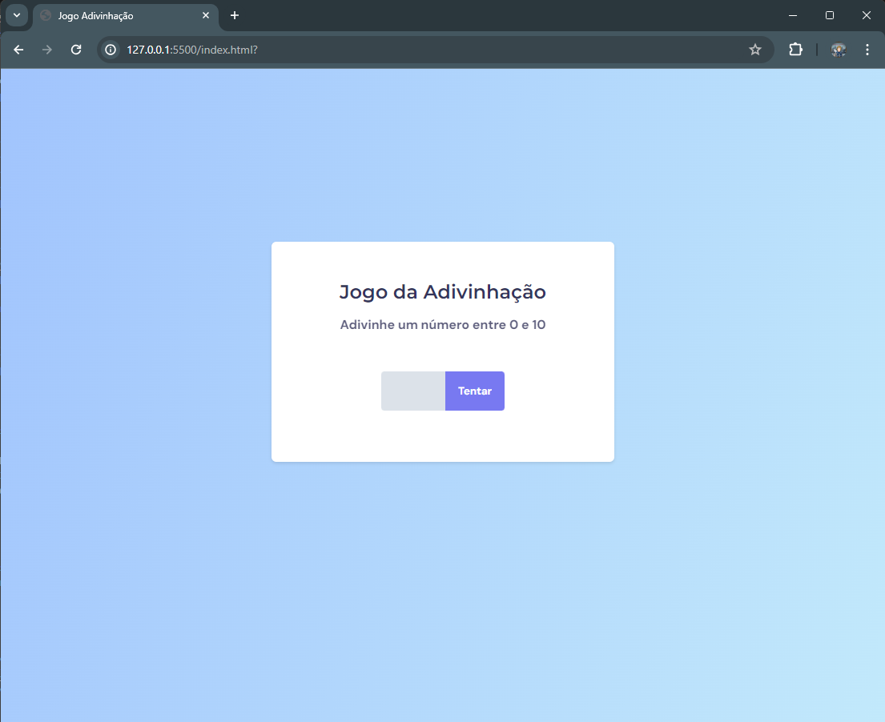

<h1 align="center"> Jogo de Adivinhação </h1>

Projeto de Adivinhação de um número de 0 a 10.

  <a href="#-tecnologias">Tecnologias</a>&nbsp;&nbsp;&nbsp;|&nbsp;&nbsp;&nbsp;
  <a href="#-projeto">Projeto</a>&nbsp;&nbsp;&nbsp;|&nbsp;&nbsp;&nbsp;
  <a href="#-layout">Layout</a>&nbsp;&nbsp;&nbsp;|&nbsp;&nbsp;&nbsp;
  <a href="#memo-licença">Licença</a>

  

 

  

## 🚀 Tecnologias

Esse projeto foi desenvolvido com as seguintes tecnologias:

- HTML e CSS
- JavaScript
- Git & GitHub

## 💻 Projeto

Esse projeto consta um algoritmo capaz de adivinhar o número que o usuário está pensando de 0 a 10. Também possui um layout responsivo para Desktops, tablets e Smartphones.
Foi utilizado a DOM (Document Object Model) para manipular os dados.

## 🔖 Layout

Você pode visualizar o layout utilizado do projeto através [DESSE LINK](https://www.figma.com/file/E71MqhKAvdzncTagvV3Cmo/Jogo-Adivinhação-Copy?fuid=988932018931308103). É necessário ter conta no [Figma](https://figma.com) para acessá-lo.
## 📝: Licença

Esse projeto está sob a licença MIT.

---

Desenvolvido por Helena Antoni.